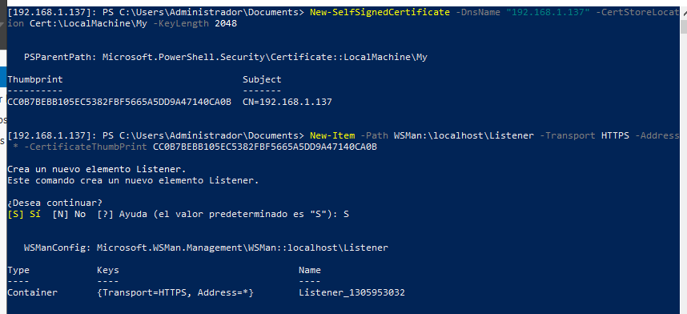
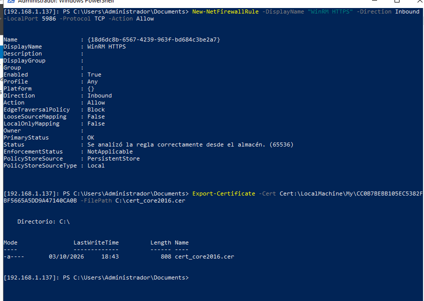

# Práctica de Administración Remota (ASO)

**Alumno:** Pablo González Coto

> **Nota técnica previa:** Durante la realización del laboratorio se produjo un cambio de ubicación física. Esto requirió adaptar el direccionamiento IP de las máquinas de la subred original (10.201.x.x) a la red local (192.168.1.x), actualizando adaptadores y resolución de nombres para restablecer WinRM.

## 1. Creación del usuario administrador en remoto

Me conecto mediante WinRM al servidor y creo el usuario `admin_pgc`, añadiéndolo al grupo de Administradores locales.

## 2. Securización de WinRM (HTTPS)

Para cifrar la conexión, genero un certificado autofirmado en el servidor Core, creo un listener HTTPS y abro el puerto 5986 en el cortafuegos.

## 3. Exportación y Confianza

Exporto el certificado del servidor y lo importo en mi máquina gráfica (almacén Raíz de confianza) para poder conectar por SSL sin errores.

## 4. Integración en Windows Admin Center

Con los dos servidores Core (2016 y 2019) configurados y securizados, los añado al panel de gestión centralizada.
