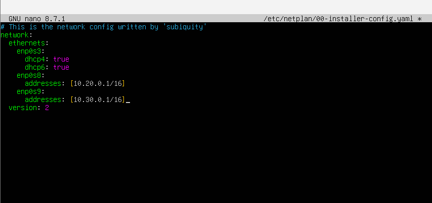
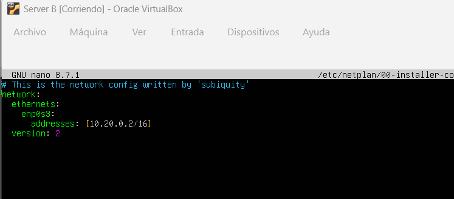
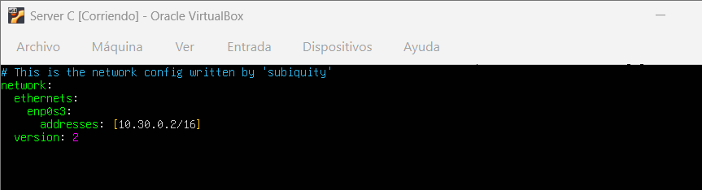
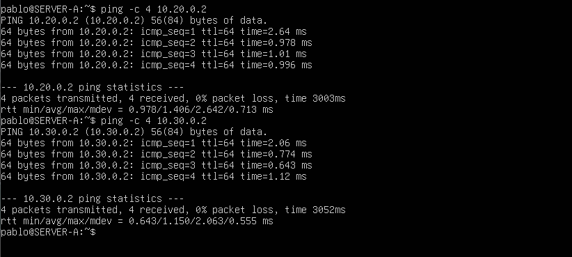
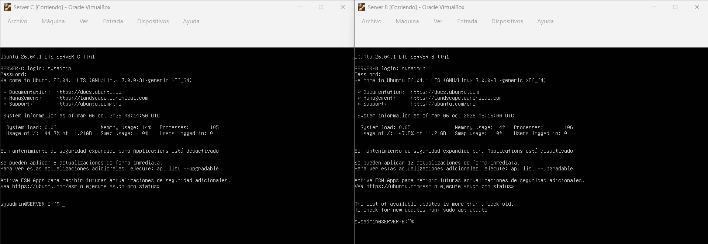
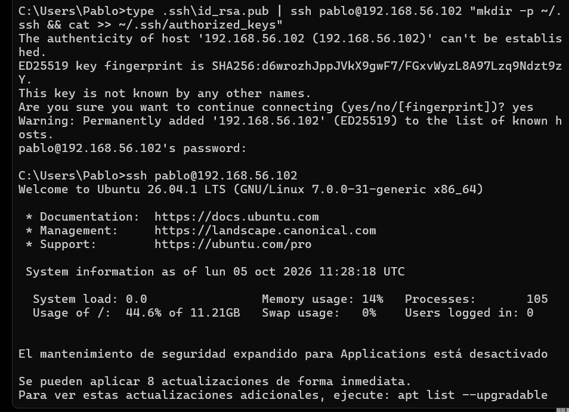
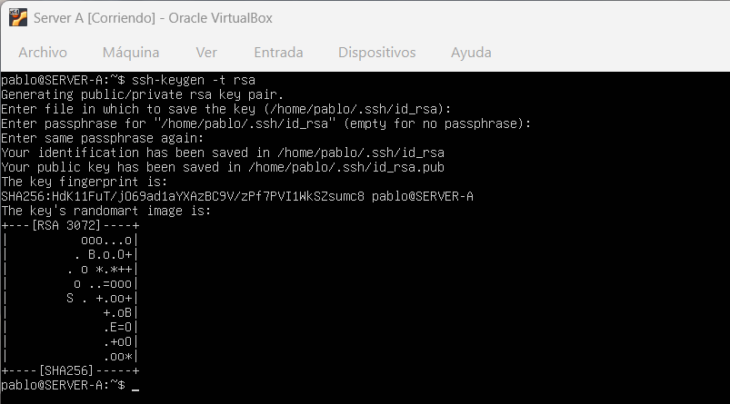
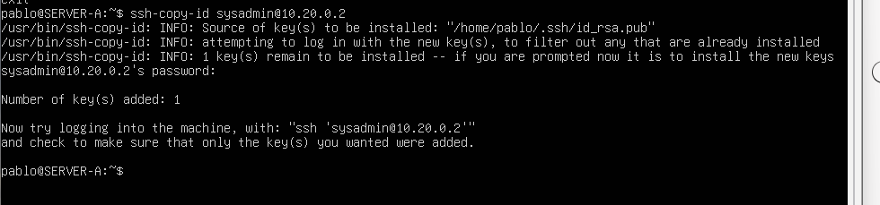
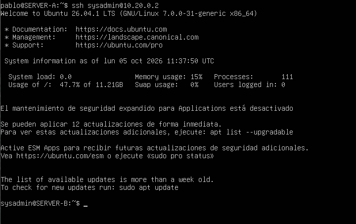

# Práctica PR0202: El protocolo SSH

**Alumno:** Pablo González Coto

## 1. Configuración de red con Netplan

Asigno las direcciones IP para aislar las redes. El SERVER-A hace de puente con tres adaptadores, mientras que el SERVER-B y SERVER-C se quedan en sus respectivas redes internas.

## 2. Conectividad y creación de usuarios

Compruebo con ping que el SERVER-A llega correctamente a las otras dos máquinas. Después, inicio sesión en B y C para crear el usuario administrador requerido.

## 3. Acceso SSH transparente desde el Anfitrión

Envío la clave pública desde la terminal de mi máquina física al SERVER-A para poder acceder de forma directa y sin contraseña.

## 4. SSH transparente entre servidores internos

Genero un par de claves RSA directamente en el SERVER-A y las distribuyo al resto de máquinas utilizando `ssh-copy-id`.

Finalmente, verifico el acceso directo al servidor sin que me solicite credenciales.

## 5. Ficheros del servicio SSH

* **`~/.ssh/id_rsa` y `id_rsa.pub`**: Par de claves criptográficas (privada y pública) empleadas para la autenticación sin contraseña.
* **`~/.ssh/authorized_keys`**: Listado de claves públicas de clientes que tienen permiso para acceder a esa cuenta.
* **`~/.ssh/known_hosts`**: Huellas digitales de los servidores conocidos para prevenir ataques de intermediario (*Man-in-the-Middle*).
* **`/etc/ssh/sshd_config`**: Archivo de configuración principal del servicio SSH en el servidor.
* **`/var/log/auth.log`**: Registro del sistema con los eventos de accesos e intentos de autenticación.
* **`/etc/hosts.allow` y `/etc/hosts.deny`**: Archivos de reglas de *TCP Wrappers* para permitir o bloquear el acceso por IP.